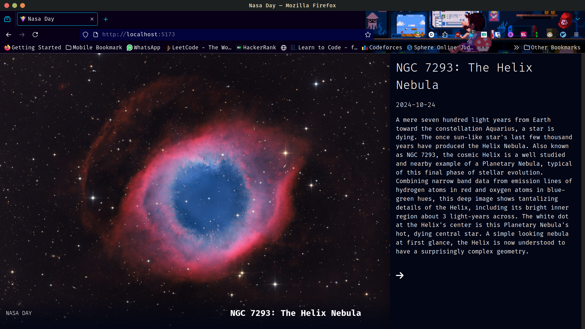

# NASA Day Explorer

A React application that displays NASA's Astronomy Picture of the Day (APOD) with an explanatory sidebar.



## Features

- Fetches the Astronomy Picture of the Day from NASA's APOD API
- Displays the space image/video with its title
- Shows detailed explanation in a clean sidebar layout
- Responsive design that works on both desktop and mobile

## Getting Started

1. Clone the repository
2. Install dependencies with `npm install`
3. Get a NASA API key from https://api.nasa.gov/
4. Create a `.env` file and add your API key as:
   ```
   REACT_APP_NASA_API_KEY=your_api_key_here
   ```
5. Run the development server with `npm start`
6. Open [http://localhost:3000](http://localhost:3000) to view it in your browser

## Built With

- React.js
- NASA APOD API
- CSS Modules for styling

## License

This project is licensed under the MIT License
